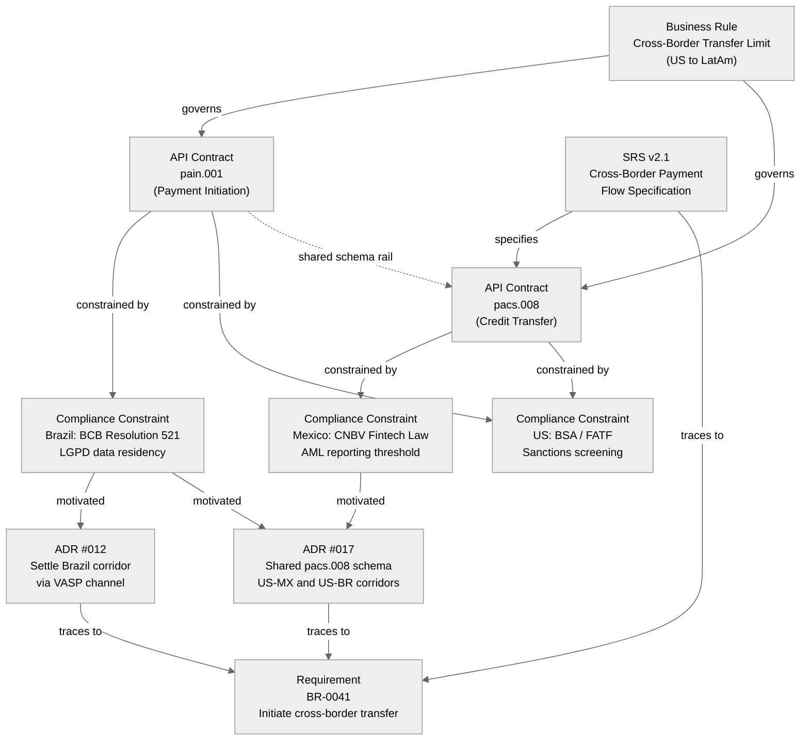

<!-- LinkedIn: https://www.linkedin.com/posts/yuliamelekhova_systemsanalysis-knowledgemanagement-fintech-activity-7488722623741231104-nh_6 -->

# Knowledge Graph: Payment Domain

Series: Systems Analyst Notes
Post: 12
Phase: 2 The Knowledge Chapter
Author: Yulia Melekhova
Published: 2026

## Purpose

A worked knowledge graph for a cross-border payment platform covering the US, Brazil and Mexico corridors. Use it as a starting shape when a regulatory or schema change needs to be traced through every artifact it touches before anyone estimates the work.

Nodes represent distinct knowledge artifacts. Edges represent dependency and traceability relationships.

---

## Graph

---

## How to read this graph

* **Solid arrows:** direct dependency or governance relationship
* **Dashed arrow:** shared schema rail between two corridors, since US–BR and US–MX both use pacs.008
* **Compliance nodes:** the widest propagation in the graph, because one regulatory update in Brazil touches ADR #012, ADR #017 and both API contracts
* **Requirement node:** the convergence point, where every ADR and the SRS trace back to a single source requirement

---

## How to adapt this to your domain

1. Replace business rules with your own: lending limits, FX conversion rules, fee structures, settlement windows
2. Replace compliance constraints with the regulations relevant to your markets
3. Keep the same relationship types: governs, constrained by, motivated, traces to, specifies
4. Add nodes for data models or event schemas if your system is event-driven

The graph earns its place by making the dependency chain visible before a change propagates through the system. A regulatory update that looks like a one-line edit turns out to touch two ADRs and an API contract, and the graph shows that in seconds rather than in the third week of the sprint.

---

## Related Artifacts

* [artifacts/post-16-context-diagram.md](https://github.com/YuliaMelekhova/systems-analyst-notes/blob/main/artifacts/post-16-context-diagram.md) - The same payment domain seen from the system boundary instead of the artifact layer
* [artifacts/post-10-tribal-knowledge-signs.md](https://github.com/YuliaMelekhova/systems-analyst-notes/blob/main/artifacts/post-10-tribal-knowledge-signs.md) - Scores how much of this dependency chain currently lives only in people's heads

---

Systems Analyst Notes · github.com/yuliamelekhova/systems-analyst-notes

LinkedIn · https://www.linkedin.com/in/yuliamelekhova
