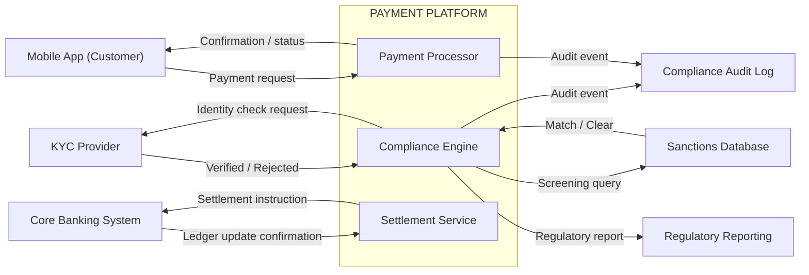

<!--
Post: 16
Title: Context Diagram — Drawing the Boundary Before Anything Else
Phase: 3 — Building the Foundation
LinkedIn: https://www.linkedin.com/posts/yuliamelekhova_systemsanalysis-businessanalysis-systemdesign-activity-7491259322354552832-FOsT?utm_source=social_share_send&utm_medium=member_desktop_web&rcm=ACoAABW2QzcBN4fI21bG0ls7u2nHq-ooXTFxjEU
-->

# Context Diagram — Payment Platform

A context diagram answers one question: what is this system, and what is it not?

It maps the system boundary and every external actor that crosses it — users, third-party services,
regulatory endpoints, downstream systems. No internal implementation detail. Only what moves
across the line and in which direction.

---

## Diagram

---

## How to read this diagram

| Element | What it represents |
|---------|-------------------|
| **Outer boundary (PAYMENT PLATFORM)** | Everything your team builds and owns |
| **Nodes outside the boundary** | External actors — you depend on them but don't control them |
| **Arrows pointing inward** | Data or instructions entering your system |
| **Arrows pointing outward** | Data or instructions your system sends out |

Internal components (PaymentProcessor, ComplianceEngine, SettlementService) appear here only
to show where data flows connect — not to describe internal architecture. A context diagram
is not a component diagram.

---

## Compliance-specific flows to map first

In regulated fintech, these flows belong on the context diagram before any others:

1. **Sanctions screening** — which external source, at which trigger point
2. **KYC / identity verification** — provider, request/response schema, failure path
3. **Audit logging** — what events, what destination, what retention requirement governs it
4. **Regulatory reporting** — which regulator, which format (FinCEN SAR, FCA SUP, etc.), frequency

If any of these flows are missing from the first version of the diagram, that's a scope gap,
not a detail to address later.

---

## Adapting this to your domain

Replace the external actors with the ones your system actually talks to. The internal
boundary label changes with your system name. The data flow labels should use your
actual field names or message types where you know them.

If a flow is currently unknown ("we haven't decided which KYC provider yet"), show it as
a placeholder with a `?` label. An unknown flow on the diagram is a conversation to have.
An unknown flow not on the diagram is a gap that stays invisible until implementation.

---

## When to revise

The context diagram almost always needs at least one revision after the first stakeholder review.
Expect it. The revision usually surfaces a missing external actor, a data flow in the wrong
direction, or a boundary disagreement. That conversation is the diagram doing its job.
