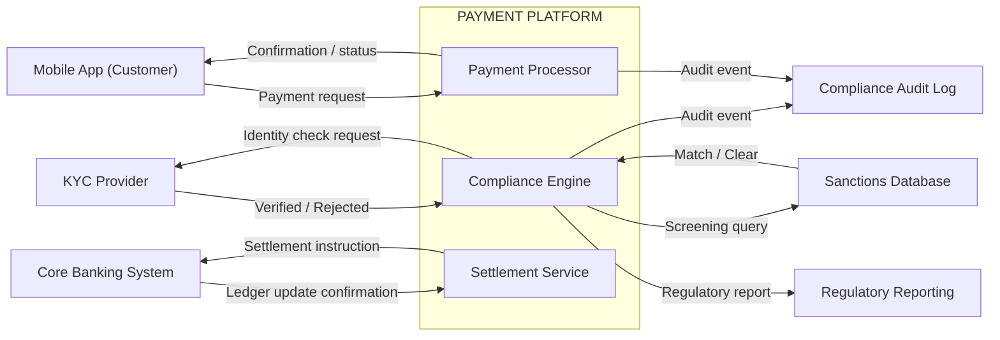

<!-- LinkedIn: https://www.linkedin.com/posts/yuliamelekhova_systemsanalysis-businessanalysis-systemdesign-activity-7491259322354552832-FOsT -->

# Context Diagram: Payment Platform

Series: Systems Analyst Notes
Post: 16
Phase: 3 Building the Foundation
Author: Yulia Melekhova
Published: 2026

## Purpose

A worked context diagram for a regulated payment platform, showing the system boundary and every external actor that crosses it. Draw this version first on a new project, before any component or sequence diagram, so the scope argument happens on a diagram instead of in the third sprint.

A context diagram answers one question: what is this system, and what is it not?

It maps the boundary and the traffic across it: users, third-party services, regulatory endpoints, downstream systems. No internal implementation detail. Only what moves across the line and in which direction.

---

## Diagram

---

## How to read this diagram

| Element | What it represents |
|---------|-------------------|
| **Outer boundary (PAYMENT PLATFORM)** | Everything your team builds and owns |
| **Nodes outside the boundary** | External actors you depend on and don't control |
| **Arrows pointing inward** | Data or instructions entering your system |
| **Arrows pointing outward** | Data or instructions your system sends out |

The internal components (PaymentProcessor, ComplianceEngine, SettlementService) appear here for one reason: to show where each external flow lands. They say nothing about internal architecture. That belongs on a component diagram.

---

## Compliance-specific flows to map first

In regulated fintech, these flows belong on the context diagram before any others:

1. **Sanctions screening:** which external source, at which trigger point
2. **KYC and identity verification:** provider, request and response schema, failure path
3. **Audit logging:** what events, what destination, what retention requirement governs it
4. **Regulatory reporting:** which regulator, which format (FinCEN SAR, FCA SUP and similar), what frequency

If any of these flows are missing from the first version of the diagram, that's a scope gap rather than a detail to address later.

---

## Adapting this to your domain

Replace the external actors with the ones your system actually talks to. The boundary label changes with your system name. The data flow labels should use your actual field names or message types where you know them.

If a flow is currently unknown ("we haven't decided which KYC provider yet"), show it as a placeholder with a `?` label. An unknown flow on the diagram is a conversation to have. An unknown flow left off the diagram is a gap that stays invisible until implementation.

---

## When to revise

The context diagram almost always needs at least one revision after the first stakeholder review. Expect it. The revision usually surfaces a missing external actor, a data flow drawn in the wrong direction, a boundary disagreement, or an actor that turns out to sit inside the boundary after all. That conversation is the diagram doing its job.

---

## Related Artifacts

* [artifacts/post-12-knowledge-graph.md](https://github.com/YuliaMelekhova/systems-analyst-notes/blob/main/artifacts/post-12-knowledge-graph.md) - The same payment domain seen from the artifact layer instead of the system boundary
* [artifacts/post-18-discovery-framework.md](https://github.com/YuliaMelekhova/systems-analyst-notes/blob/main/artifacts/post-18-discovery-framework.md) - The discovery work that produces the actors on this diagram
* [artifacts/post-14-intake-checklist.md](https://github.com/YuliaMelekhova/systems-analyst-notes/blob/main/artifacts/post-14-intake-checklist.md) - Uses the boundary to answer the dependency gate

---

Systems Analyst Notes · [github.com/yuliamelekhova/systems-analyst-notes](https://github.com/YuliaMelekhova/systems-analyst-notes)

LinkedIn · https://www.linkedin.com/in/yuliamelekhova
