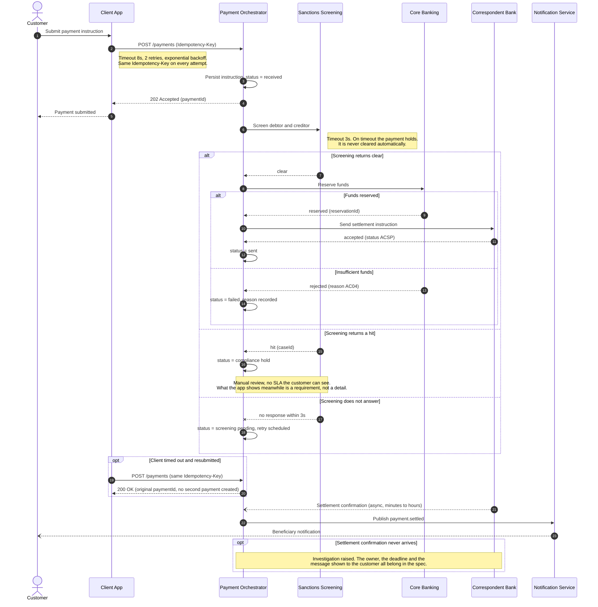

<!-- LinkedIn: -->

# Cross-Service Payment Sequence

**Series:** Systems Analyst Notes  
**Post:** 25  
**Phase:** 4 APIs as Products  
**Author:** Yulia Melekhova  
**Published:** 2026  

## Purpose

Draws one payment instruction as a timed conversation between six services, with the branches, the waiting, the timeouts and the duplicate submission shown rather than described. Reach for it when a prose flow description has stopped answering questions about ordering.

---

## How to Adapt It

Rename the participants to your own services and keep four things: the alt branches, the timeout notes on the arrows that leave your boundary, the idempotency key on every retry, and the async confirmation that arrives from a participant nobody called.

---

## Related Artifacts

* [artifacts/post-16-context-diagram.md](https://github.com/YuliaMelekhova/systems-analyst-notes/blob/main/artifacts/post-16-context-diagram.md) - Draws the boundary these arrows cross, before the ordering matters
* [artifacts/post-19-unhappy-path-mapping.md](https://github.com/YuliaMelekhova/systems-analyst-notes/blob/main/artifacts/post-19-unhappy-path-mapping.md) - Where the alt branches in this diagram come from
* [artifacts/post-22-api-contract-template.yaml](https://github.com/YuliaMelekhova/systems-analyst-notes/blob/main/artifacts/post-22-api-contract-template.yaml) - The contract each arrow is calling, including the timeout and retry fields annotated here
* [artifacts/post-21-requirement-decomposition-template.md](https://github.com/YuliaMelekhova/systems-analyst-notes/blob/main/artifacts/post-21-requirement-decomposition-template.md) - Names the owner of every participant on this diagram before the conversation is specified
* [artifacts/post-28-api-versioning-policy.md](https://github.com/YuliaMelekhova/systems-analyst-notes/blob/main/artifacts/post-28-api-versioning-policy.md) - How this same participant list turns into a notice period and a breaking-change classification

---

Systems Analyst Notes · [github.com/YuliaMelekhova/systems-analyst-notes](https://github.com/YuliaMelekhova/systems-analyst-notes)

LinkedIn · https://www.linkedin.com/in/yuliamelekhova
