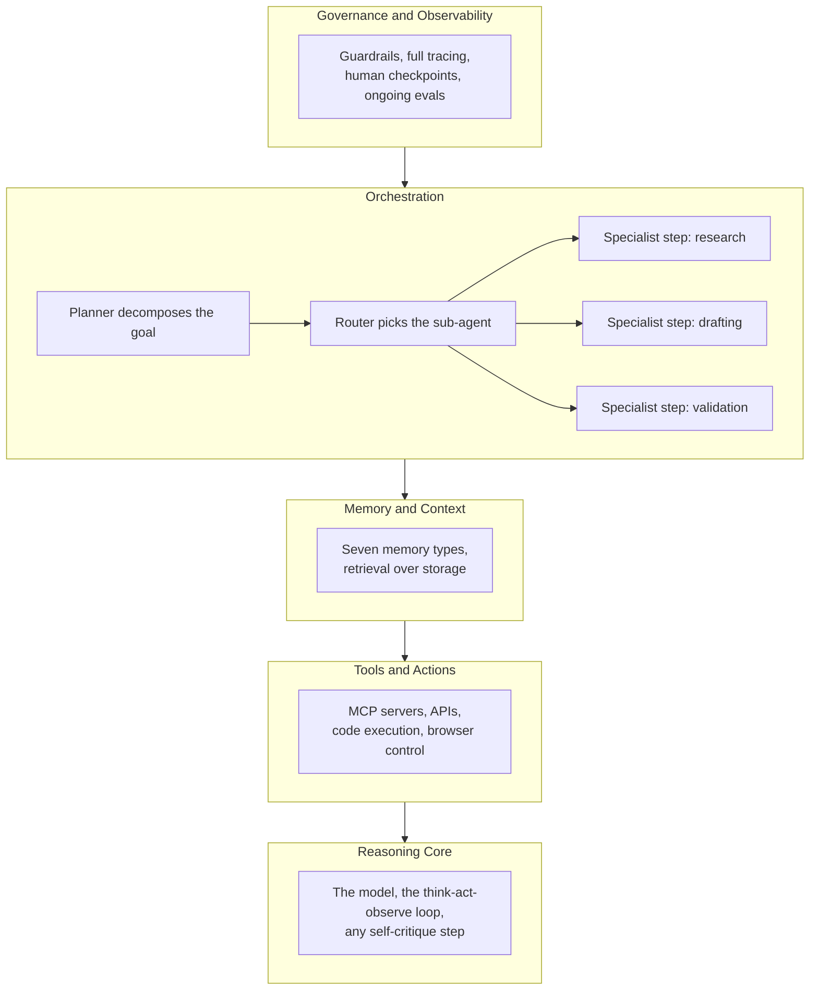

<!-- LinkedIn: -->

# AI Agent Instruction Standard

**Series:** Systems Analyst Notes  
**Post:** 41  
**Phase:** 6 AI Agents at Work  
**Author:** Yulia Melekhova  
**Published:** 2026

## Purpose

Names the seven fields every AI agent needs on record before it reaches production, maps each field to the regulatory and technical frameworks that constrain it, and ties both to a pre-launch checklist a reviewer can actually run. Fill in one copy per agent.

---

## 1. Scope

This standard covers one agent, doing one job, at one point in its lifecycle. A multi-agent system gets one filled copy per agent, not one copy for the whole system, because the identity, tool access, and checkpoint tier named in section 2 are properties of a single agent instance, not of the system around it.

The seven parameters are the minimum record. A parameter with no value is a gap, not an optional field, and a gap in this standard is the same gap the pre-launch checklist in section 4 is built to catch.

---

## 2. The seven parameters

| # | Parameter | What it must state |
|---|---|---|
| 1 | Purpose and Scope | The task the agent performs, in one sentence, plus what it is explicitly not authorized to do |
| 2 | Identity and Action Authority | An identity assigned to the agent itself, not inherited from a user account, the specific actions it may take, and the threshold above which an action requires escalation |
| 3 | Guardrail Layer Assignment | Which of the seven guardrail layers (Input, Prompt, Retrieval, Tool, Output, Runtime, Memory) apply, and the control that enforces each one |
| 4 | Tool and Permission Allowlist | The named tools and MCP connections the agent may call, the permissions scoped to each, and the sandboxing in place |
| 5 | Memory and Retention Policy | Which memory types the agent uses, the retention period per type, the identity resolution rule, and whether an unattributed session may write to long-term memory |
| 6 | Human Checkpoint Tier | Which of the five HITL tiers, auto-proceed, lightweight confirm, explicit approval, blocked, or kill switch, applies to each action category the agent performs |
| 7 | Observability and Audit Record | The log types captured, the model version pinned, the evaluation set referenced, and the acceptable failure rate per task type |

A parameter is not satisfied by a sentence describing intent. Parameter 2 is not satisfied by "the agent acts responsibly." It is satisfied by a named identity, a named action list, and a named dollar or risk threshold. The test for every row: could a reviewer who has never met the agent's builder check this field against a system log and get a yes or no answer.

---

## 3. Framework mapping

Eight frameworks recur across the fintech domains this series covers. Each constrains a specific subset of the seven parameters rather than the standard as a whole, which is what makes the mapping useful instead of a generic compliance footnote.

| Framework | Constrains | What it adds |
|---|---|---|
| BABOK | Parameter 1 | Traceability from the agent's stated purpose back to the business requirement that authorized building it |
| ISO 20022 | Parameters 4, 7 | Message schema validation on any tool call touching a payment field, and field-level logging that matches the message standard's own audit expectations |
| Open Banking Standards | Parameter 2 | Consent scope and third-party access rules that define what "authorized" means for an agent acting on a customer's behalf |
| OpenAPI / RFC 9110 | Parameter 4 | Contract conformance for every API the agent calls, so a tool allowlist entry maps to a versioned, documented interface rather than an undocumented endpoint |
| STRIDE | Parameter 3 | A threat category behind each guardrail layer, so "Tool guardrail" has a named failure mode (spoofing, tampering) it is actually defending against |
| LGPD / LFPDPPP / PCI DSS | Parameter 5 | Retention limits and field-level redaction rules per data classification, by market |
| BSA / AML / FATF | Parameter 6 | The compliance hold and escalation path that a sanctions or AML signal must trigger, regardless of what tier the action would otherwise sit in |
| Microsoft Manual of Style | All seven | Governs how every parameter is worded: plain language, one term per concept, no invented jargon a future reviewer has to decode |

The last row is different in kind from the rest. It does not add a control. It sets the readability bar the other seven rows are written against, which is why a standard that scores well on parameters 1 through 7 can still fail a review if the wording drifts between two versions of the same field.

---

## 4. The five-layer agent stack

The seven parameters sit inside a structure, read bottom-up. Governance is not a layer added once the rest works. It is the layer the other four are built underneath.

Each layer maps back to one or more of the seven parameters. Reasoning core and Tools and actions are governed by parameters 2 and 4. Memory and context is parameter 5. Orchestration is where parameter 6's checkpoint tiers actually get enforced, since the router is what decides whether a step proceeds, pauses, or escalates. Governance and observability is parameters 3 and 7 together, sitting on top because a control that only checks the final output has already let a failure travel through four layers before catching it.

---

## 5. Pre-launch checklist gate

Fourteen items turn the seven parameters from a document into something a governance review can test line by line. Each one needs an owner and an answer, not a description.

Agent register entry. Named business owner. Named technical owner. Written purpose statement. Risk classification. Data classification. Permission model. Audit trail. Human-in-the-loop rules. Escalation logic. Quality monitoring. Incident process. Change management, tracked separately for prompts, models, tools, and retrieval sources. Kill switch.

Five checks decide whether an agent clears the gate:

1. Does every one of the seven parameters have a value that a reviewer could check against a log, not just a sentence of intent?
2. Is the agent's identity separate from the identity of whoever is running it, and can a tool call be traced back to that specific agent instance?
3. Is there a named failure rate threshold per task type, with the task types that require human review for every output named explicitly?
4. Does the checkpoint tier in parameter 6 name the specific control that enforces it, an allowlist check, a confidence threshold, an output validator, rather than describing the tier alone?
5. Is the model version pinned in the observability record, so a decision can be attributed to a specific version even after the vendor retires it?

An agent that answers yes to all five is ready for the kind of review a compliance team will actually run. An agent that answers yes to the first four and no to the fifth has a governance document. It does not yet have a defensible one.

---

## Related Artifacts

* [artifacts/post-39-hitl-checkpoint-spec.md](https://github.com/YuliaMelekhova/systems-analyst-notes/blob/main/artifacts/post-39-hitl-checkpoint-spec.md) - The five-tier checkpoint structure that parameter 6 references, with the enforcing control per tier and the kill switch condition, effect, and re-enable path

---

Systems Analyst Notes · [github.com/YuliaMelekhova/systems-analyst-notes](https://github.com/YuliaMelekhova/systems-analyst-notes)

LinkedIn · https://www.linkedin.com/in/yuliamelekhova
