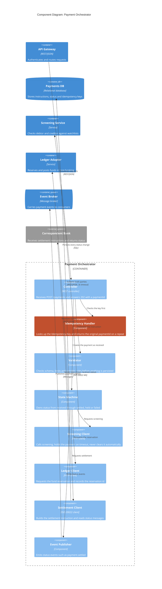

<!-- LinkedIn: -->

# C4 Level 3: Component Diagram for the Payment Orchestrator

**Series:** Systems Analyst Notes  
**Post:** 49  
**Phase:** 6 AI Agents at Work  
**Author:** Yulia Melekhova  
**Published:** 2026

## Purpose

Opens one container, the Payment Orchestrator, into the eight components that carry its behavior. Reach for it when a rule such as idempotency, screening timeouts or status ownership needs a named place to live before anyone writes the spec.

---

## Diagram

## What this level shows

The building blocks inside one container, grouped by responsibility rather than by class name. Only the neighbors that the orchestrator actually calls appear outside the boundary.

The idempotency handler is highlighted because it is where the sequence diagram's duplicate-submission question gets its answer. The same Idempotency-Key arriving twice returns the original paymentId and creates no second payment. Before this diagram, that rule lived in a note on an arrow. Now it has an address, an owner and a place for a test.

Level 4, the classes and tables behind each component, is deliberately missing. Generate it from the codebase when someone needs it. A hand-drawn version is wrong within a sprint.

## How to adapt it

**Step 1: Pick one container to open.** Choose the one where most rules live, usually the one every other container talks to.

**Step 2: List its components by responsibility.** "Idempotency Handler" is a responsibility. "PaymentServiceImpl" is a class.

**Step 3: Show only what crosses the container boundary.** Draw the neighbors this container calls and nothing further away.

**Step 4: Stop here unless a component's behavior is disputed.** If it is, draw a sequence diagram for that one component rather than a level 4 diagram.

---

## Related Artifacts

* [artifacts/post-49-c4-diagrams/container.md](https://github.com/YuliaMelekhova/systems-analyst-notes/blob/main/artifacts/post-49-c4-diagrams/container.md) - Level 2, where the Payment Orchestrator box comes from
* [artifacts/post-25-sequence-diagram.md](https://github.com/YuliaMelekhova/systems-analyst-notes/blob/main/artifacts/post-25-sequence-diagram.md) - The timeouts and retries annotated on its arrows are the rules these components carry
* [artifacts/post-22-api-contract-template.yaml](https://github.com/YuliaMelekhova/systems-analyst-notes/blob/main/artifacts/post-22-api-contract-template.yaml) - The contract behind the Controller and the Settlement Client
* [artifacts/post-23-adr-template.yaml](https://github.com/YuliaMelekhova/systems-analyst-notes/blob/main/artifacts/post-23-adr-template.yaml) - Where the decision to hold on a screening timeout gets recorded

---

Systems Analyst Notes · [github.com/YuliaMelekhova/systems-analyst-notes](https://github.com/YuliaMelekhova/systems-analyst-notes)

LinkedIn · https://www.linkedin.com/in/yuliamelekhova
