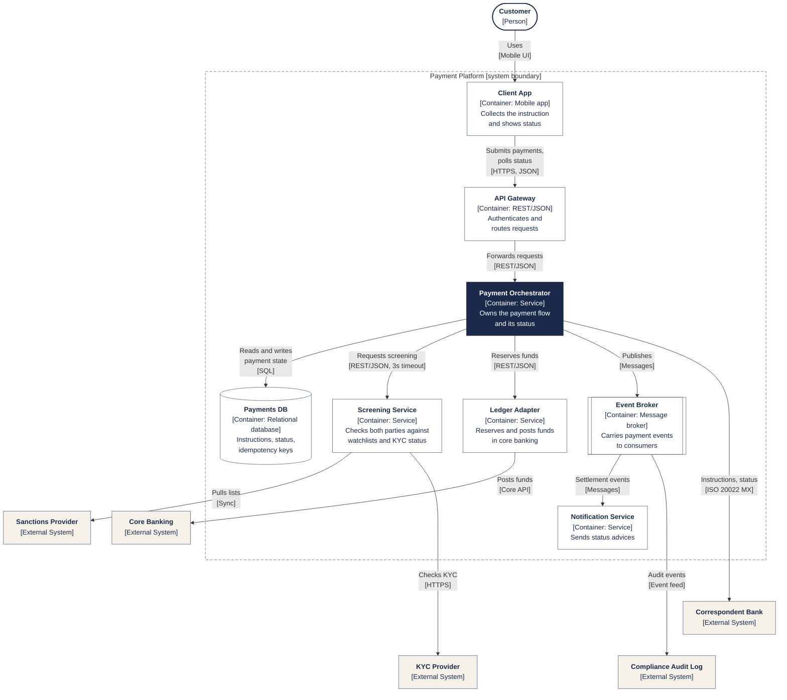

<!-- LinkedIn: -->

# C4 Level 2: Container Diagram for a Cross-Border Payment Platform

**Series:** Systems Analyst Notes  
**Post:** 49  
**Phase:** 6 AI Agents at Work  
**Author:** Yulia Melekhova  
**Published:** 2026

## Purpose

Opens the Payment Platform box into the eight separately running parts that make it work, with the technology and the labeled relationships between them. Reach for it when someone asks what runs where, or what a change to one service touches.

---

## Diagram

**Notation:** Drawn as a Mermaid flowchart that follows C4 conventions: every box carries a name, a type and a description, and every line a verb and a protocol. Mermaid's native C4 syntax is not used because its automatic layout puts labels on top of lines once a diagram passes a handful of relationships.

## What this level shows

The parts that run on their own inside one system. A container here has nothing to do with Docker. It is a mobile app, an API, a message broker, a database: anything that executes code or holds state separately from the rest.

The orchestrator sits at the center because most other containers talk to it or through it. The Screening Service is the one that talks to the sanctions and KYC providers. That makes it the box to open next, and it is the one `component.md` zooms into.

Every box carries a name, a type, a technology and one line of description. A box that says "Service" and nothing else is a placeholder.

## How to adapt it

**Step 1: List what runs separately, one box each.** Include databases, brokers and queues. Leave out libraries and classes, which belong one level down.

**Step 2: Write the technology on every box.** If nobody on the team can say what a box is built with, that is a finding.

**Step 3: Label each line with a verb and a protocol.** Add timeouts where a failure would stall the payment, the way the screening line does here.

**Step 4: Check that nothing from level 3 leaked in.** A controller or a class on this diagram means two zoom levels are mixed, which is the failure C4 exists to prevent.

---

## Related Artifacts

* [artifacts/post-49-c4-diagrams/context.md](https://github.com/YuliaMelekhova/systems-analyst-notes/blob/main/artifacts/post-49-c4-diagrams/context.md) - Level 1, the boundary this diagram opens
* [artifacts/post-49-c4-diagrams/component.md](https://github.com/YuliaMelekhova/systems-analyst-notes/blob/main/artifacts/post-49-c4-diagrams/component.md) - Level 3, which opens the Payment Orchestrator box
* [artifacts/post-21-requirement-decomposition-template.md](https://github.com/YuliaMelekhova/systems-analyst-notes/blob/main/artifacts/post-21-requirement-decomposition-template.md) - Names an owner for each container before requirements are split
* [artifacts/post-25-sequence-diagram.md](https://github.com/YuliaMelekhova/systems-analyst-notes/blob/main/artifacts/post-25-sequence-diagram.md) - Shows the order of the calls drawn here as unordered lines

---

Systems Analyst Notes · [github.com/YuliaMelekhova/systems-analyst-notes](https://github.com/YuliaMelekhova/systems-analyst-notes)

LinkedIn · https://www.linkedin.com/in/yuliamelekhova
