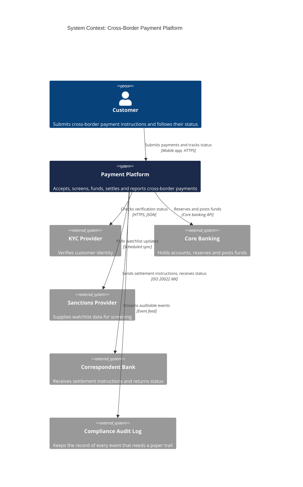

<!-- LinkedIn: -->

# C4 Level 1: System Context for a Cross-Border Payment Platform

**Series:** Systems Analyst Notes  
**Post:** 49  
**Phase:** 6 AI Agents at Work  
**Author:** Yulia Melekhova  
**Published:** 2026

## Purpose

Draws the payment platform as one box with the people and external systems around it. Reach for it first, before any container or component diagram, to agree what sits inside the system and what does not.

---

## Diagram

## What this level shows

One system and its neighbors. Nothing about technology, nothing about what runs inside the box. The reader is anyone: a sponsor, a new hire, a compliance officer.

Six neighbors appear here: the customer, core banking, the KYC provider, the sanctions provider, the correspondent bank and the compliance audit log. If a stakeholder looks at this picture and says the platform does not call one of them directly, that conversation is cheap now and expensive after two sprints.

Every line carries a verb and a protocol. An unlabeled line says only that two things are somehow related.

## How to adapt it

**Step 1: Name the system and write its job in one sentence.** The sentence becomes the description on the central box.

**Step 2: List every person and external system that sends data to it or receives data from it.** Count them. A list longer than nine usually means two systems are drawn as one.

**Step 3: Label each line with a verb and a protocol.** "Reserves and posts funds over a core banking API" beats "integrates with".

**Step 4: Show the diagram to someone outside the team and fix what they cannot read.** Their first question is usually about a neighbor you forgot or a line you left vague.

---

## Related Artifacts

* [artifacts/post-49-c4-diagrams/container.md](https://github.com/YuliaMelekhova/systems-analyst-notes/blob/main/artifacts/post-49-c4-diagrams/container.md) - Level 2, which opens the Payment Platform box into its separately running parts
* [artifacts/post-16-context-diagram.md](https://github.com/YuliaMelekhova/systems-analyst-notes/blob/main/artifacts/post-16-context-diagram.md) - The earlier context diagram, before element types and audience labels were added
* [artifacts/post-25-sequence-diagram.md](https://github.com/YuliaMelekhova/systems-analyst-notes/blob/main/artifacts/post-25-sequence-diagram.md) - The same payment drawn as a timed conversation between these systems
* [artifacts/post-22-api-contract-template.yaml](https://github.com/YuliaMelekhova/systems-analyst-notes/blob/main/artifacts/post-22-api-contract-template.yaml) - Where each labeled line gets its contract

---

Systems Analyst Notes · [github.com/YuliaMelekhova/systems-analyst-notes](https://github.com/YuliaMelekhova/systems-analyst-notes)

LinkedIn · https://www.linkedin.com/in/yuliamelekhova
