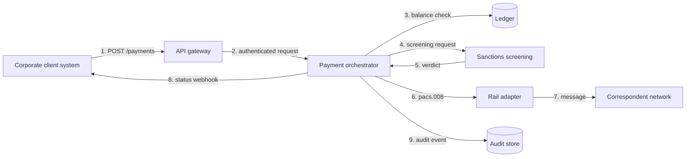

# STRIDE Threat Model: Cross-Border Payment Initiation

**Series:** Systems Analyst Notes  
**Branch:** STRIDE Threat Modeling  
**Author:** Yulia Melekhova  
**Published:** 2026  

## Purpose

One worked STRIDE pass over a single flow, cross-linked to the requirements each threat changes. Reach for it as a shape to copy when threat modeling a payment flow, rather than as a control list to import.

---

## Why This Sits Next to Requirements

A threat model filed in a security folder gets read during audits. A threat model cross-linked to the requirement it changes gets read during build. The difference is not the content. It is whether the analyst writing the acceptance criteria can see the threat from where they are working.

Every row in the tables below ends with the artifact that has to change. If a threat produces no change to any requirement, API contract or test case, it was an observation and not a finding.

---

## The Flow Being Modeled

A corporate client initiates a cross-border payment through a hosted API. Funds move from a source account in one market to a beneficiary in another, over a correspondent rail.

Four trust boundaries:

* **B1** between the client system and the API gateway. Everything crossing it is untrusted input.
* **B2** between the gateway and the orchestrator. Internal, and still a boundary, because a compromised gateway must not be able to author payments.
* **B3** between the orchestrator and sanctions screening. A verdict crossing this boundary carries regulatory weight.
* **B4** between the rail adapter and the correspondent network. Beyond this point the message is outside the organization's control.

---

## Spoofing

| Threat | Where | Requirement change |
|---|---|---|
| Stolen API credential used to submit payments as a legitimate client | B1 | Client authentication requirement specifies mutual TLS plus signed request bodies, not a bearer token alone. Key rotation interval is stated, not implied. |
| Screening verdict forged by a component impersonating the screening service | B3 | Verdict payload carries a signature the orchestrator validates. The requirement names what the orchestrator does with an unsigned verdict, and the answer is reject rather than proceed. |
| Webhook receiver impersonated, so status notifications go to an attacker | B1 outbound | Callback URL registration is an authenticated operation with its own approval step. Changing a callback URL is treated as a sensitive action, not a profile edit. |
| Internal service calling the orchestrator without service identity | B2 | Service-to-service authentication is a stated requirement with a named mechanism. "Internal network" is not an authentication mechanism. |

The webhook row is the one teams most often miss. A payment API is usually specified with careful attention to the inbound direction and casual attention to the outbound one.

---

## Tampering

| Threat | Where | Requirement change |
|---|---|---|
| Beneficiary account modified in transit between gateway and orchestrator | B2 | Request integrity is verified at the orchestrator against the client signature, not only at the gateway. The signature covers the beneficiary fields explicitly. |
| Amount altered after balance check and before message construction | Internal | The orchestrator constructs the outbound message from the record it validated, not from a mutable in-flight object. The requirement states which record is authoritative. |
| Address fields rewritten to defeat screening | B3 to B4 | Screening runs against the exact field values that go into pacs.008. If enrichment happens after screening, screening runs again. This is a sequencing requirement, and it belongs in the flow spec. |
| Audit event modified or deleted after write | B4 internal | Audit store is append-only. The requirement names the retention period and states that the application service has no delete permission. |

The third row connects directly to the structured address work. Any enrichment step that changes address content after screening has opened a gap, and address enrichment is being added to a lot of systems ahead of November 2026.

---

## Repudiation

| Threat | Where | Requirement change |
|---|---|---|
| Client disputes having initiated a payment | B1 | Request signature is stored alongside the payment record for the full retention period. The requirement specifies storage, not just verification. |
| No record of who approved a payment held for manual review | Internal | Approval action records actor identity, timestamp, and the exact state of the payment at approval. An approval with no captured payload proves nothing. |
| Screening decision cannot be reconstructed months later | B3 | The screening record stores list version and match scores, not only the verdict. A regulator asking why a payment passed needs the inputs, and list contents change weekly. |
| Automated retry indistinguishable from a second client submission | B1 | Idempotency key is required on the endpoint, and the requirement states the deduplication window. |

The idempotency row belongs under repudiation as much as under availability. Without it, a duplicate payment has no defensible answer to who caused it.

---

## Information Disclosure

| Threat | Where | Requirement change |
|---|---|---|
| Beneficiary details exposed in error responses | B1 | Error contract defines exactly which fields appear in each error class. Echoing the submitted payload back on validation failure is prohibited by the contract. |
| Full account numbers written to application logs | Internal | Logging requirement names the masked fields and applies to third-party libraries, which is where the leak usually happens. |
| Screening match details returned to the client | B1 | Client receives a generic hold status. Match reasons stay internal, because a specific reason tells a bad actor how to reshape the next attempt. |
| Correlation across payments through predictable identifiers | B1 | Payment identifiers are non-sequential. Sequential IDs disclose volume to anyone holding two of them. |
| Address enrichment vendor receives more data than the parse needs | External | The vendor contract and the integration spec agree on the minimum field set sent. This is a data protection question in every market in the governance matrix. |

---

## Denial of Service

| Threat | Where | Requirement change |
|---|---|---|
| Bulk file submission saturates synchronous validation | B1 | Bulk intake is asynchronous with a stated queue depth and a documented backpressure response. The API contract states what the client sees when the queue is full. |
| Screening provider slow, orchestrator threads exhausted | B3 | Timeout and circuit breaker on the screening call, with a defined behavior on open circuit. Holding the payment is a valid answer. Proceeding without screening is not, and the requirement says so. |
| Retry storm from a client misreading a 5xx response | B1 | Retry guidance is part of the published contract, including backoff expectations and which status codes are safe to retry. |
| Ledger contention under settlement-window load | Internal | Availability and consistency targets are stated ahead of latency targets, matching the payment NFR order, and load tests run against the settlement-window profile rather than an average. |

---

## Elevation of Privilege

| Threat | Where | Requirement change |
|---|---|---|
| Client submits a payment on behalf of an account it does not own | B1 | Authorization is checked against the account, not only against the authenticated client. The requirement states this as an explicit rule with its own test case. |
| Operations user approves a payment they also created | Internal | Segregation of duties is a stated requirement with the roles named. Creator and approver cannot be the same identity, and the system enforces it rather than the policy document. |
| Screening bypass flag reachable through the public API | B1 | The flag does not exist in the external contract. Any internal override is a separate authenticated path with its own audit trail. |
| Compromised rail adapter authors new payments rather than forwarding them | B2 | The adapter holds no permission to create payment records. Its role is send-only, and the permission model says so. |

---

## How to Run This on a New Flow

**Step 1: Draw the flow with its trust boundaries.** Not the architecture diagram. The data flow, with the points where trust changes marked.

**Step 2: Walk the six letters against each boundary.** Six letters times four boundaries is twenty-four prompts. Most produce nothing. The ones that produce something are worth the pass.

**Step 3: Name the requirement that changes.** A threat with no artifact attached is a note. Discard it or convert it.

**Step 4: Link both directions.** The requirement links to the threat model, and the threat model links to the requirement. One-directional linking decays within a quarter, because the person editing the requirement never sees the threat.

**Step 5: Re-run on boundary changes, not on a calendar.** Adding a vendor, splitting a service, or exposing a new endpoint moves a boundary. A quarterly review on an unchanged flow finds nothing.

---

## Related Artifacts

* [knowledge-packs/iso-20022-cbpr-plus.md](https://github.com/YuliaMelekhova/systems-analyst-notes/blob/main/knowledge-packs/iso-20022-cbpr-plus.md) - The address enrichment step that creates the screening-sequence threat above
* [artifacts/post-19-unhappy-path-mapping.md](https://github.com/YuliaMelekhova/systems-analyst-notes/blob/main/artifacts/post-19-unhappy-path-mapping.md) - Every threat here produces at least one unhappy path that needs a specified response
* [artifacts/post-16-context-diagram.md](https://github.com/YuliaMelekhova/systems-analyst-notes/blob/main/artifacts/post-16-context-diagram.md) - Trust boundaries are drawn on top of a context diagram, so that one comes first
* [governance-matrix/market-framework-matrix.csv](https://github.com/YuliaMelekhova/systems-analyst-notes/blob/main/governance-matrix/market-framework-matrix.csv) - Which of these controls are regulatory obligations depends on the market

---

Systems Analyst Notes · [github.com/YuliaMelekhova/systems-analyst-notes](https://github.com/YuliaMelekhova/systems-analyst-notes)

LinkedIn · https://www.linkedin.com/in/yuliamelekhova
